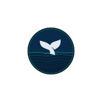

<div align="center">


### A data-driven analysis of ocean plastic — from the rivers that carry it, to the marine life that suffers, to the people working to stop it.

*Built with Python · Streamlit · Plotly · Pandas · MySQL · Tableau · 2026*
</div>
---

## Table of Contents

- [Project Overview](#project-overview)
- [Key Findings](#key-findings)
- [Research Questions & Hypotheses](#research-questions--hypotheses)
- [Dashboard](#dashboard)
- [Data](#data)
- [Data Sources](#data-sources)
- [Repository Structure](#repository-structure)
- [Setup & Installation](#setup--installation)
- [Notebooks](#notebooks)
- [Tableau](#tableau)
- [Beyond the Data](#beyond-the-data)
- [Valuable Extensions](#valuable-extensions)
- [Links](#links)

---

## Project Overview

Every year, **1.001.000 tonnes** of plastic enters the world's oceans — not in one catastrophic event, but bottle by bottle, bag by bag, through rivers and coastlines across the globe.

**Source to Sea** is an end-to-end data science project that traces that journey: from the rivers that carry plastic into the sea, through the gyres where it accumulates, to the marine animals and ultimately the humans who are affected — and the organisations working to stop it.

The project combines a **MySQL relational database**, a **modular analytical notebook pipeline**, a **10-page interactive Streamlit dashboard** and a **Tableau workbook** to answer six research questions with stated, testable hypotheses.

---

## Key Findings

- The **top 10 rivers** account for **14,56%** of global riverine plastic emissions per year
- **1.000+ rivers** account for **80%** of all river plastic entering the ocean
- The **Philippines** alone contributes ~35% of global river plastic, with the Pasig River as the single largest emitter (~63.000 t/yr)
- The **North Pacific Gyre** holds an estimated ~87.000 tonnes of accumulated plastic — the largest of the five gyres
- The best-performing interceptor (**Rio Las Vacas, Guatemala**) captures ~10.000 t/yr — the benchmark for the What If? scenario model
- At 100 interceptors at full efficiency, ~100% of annual river input could theoretically be offset; at a realistic 30–50% fleet efficiency, ~150–200 units would be needed
- The cleanup sector is growing but remains orders of magnitude below annual input — **best recorded year: ~2,9% of annual input recovered**

---

## Research Questions & Hypotheses

### Q1 — Where does ocean plastic come from?
*"Which countries and rivers contribute the most plastic to the ocean?"*

- **H1:** A small number of rivers (top 10) account for the majority of plastic entering the ocean
- **H2:** Plastic input correlates with income group — lower income countries contribute more due to less waste infrastructure
- **H3:** Asian rivers dominate global plastic input

### Q2 — Where does plastic accumulate?
*"Where does plastic end up once it enters the ocean?"*

- **H1:** The majority of floating plastic concentrates in 5 gyre systems, with the North Pacific being the largest
- **H2:** Coastal regions near high-input rivers show disproportionately high surface plastic density

### Q3 — What is the impact?
*"Which ecosystems and species are most affected by ocean plastic?"*

- **H1:** Marine species in gyre regions show higher plastic ingestion rates than open ocean species
- **H2:** Ghost nets account for a disproportionate share of large marine animal entanglement cases
- **H3:** Different animal groups ingest different types of plastic
- **H4:** Microplastic contamination in commercially consumed fish represents a measurable risk of human dietary exposure

### Q4 — Are cleanup efforts working?

- **H1:** Plastic accumulation has grown faster than cleanup efforts can offset
- **H2:** Scaling interceptor deployment to ~100 high-throughput units on the world's most polluting rivers would be sufficient to offset annual plastic input from rivers

### Q5 — Where should we clean up next?
*"Which rivers are the highest priority targets for interceptor deployment?"*

- **H1:** Rivers not yet targeted by interceptors contribute a significant share of total plastic input
- **H2:** A combination of plastic volume + population density + lack of waste infrastructure identifies the highest-priority rivers
- **H3:** Deploying interceptors in the top 5 unaddressed rivers could reduce ocean plastic input by 25%

### Q6 — What if?

**Q6a** — Does it matter *where* we deploy interceptors? Comparing global optimal deployment vs Europe-only vs high-income countries only.
- **H1:** Europe and high-income countries contribute a negligible share of global river plastic emissions
- **H2:** Deploying interceptors in high-income countries is significantly less effective than optimal global deployment

**Q6b** — Can cleanup growth outpace plastic input?
- **H3:** At historical cleanup growth rates, parity with annual plastic input is reachable before 2040

---

## Dashboard

The Streamlit app is structured as a guided narrative across 10 pages:

| # | Page | Description |
|---|------|-------------|
| 01 | Introduction | Project overview, data sources, and page-by-page navigation map |
| 02 | Global Overview | Key KPIs, ocean gyre accumulation map, country choropleth, interceptor status |
| 03 | Check Your Country | Country selector with river mouth map, emission profile and top emission points |
| 04 | Animal Impact | How plastic kills — sea turtles, whales, seals, seahorses and fish |
| 05 | Marine Impact | Ingestion and entanglement rate analysis across species groups; fish-to-human microplastic chain |
| 06 | Cleanup Information | Three intervention methods: land cleanups, beach cleanups and river interceptors |
| 07 | Cleanup Progress | Year-on-year removal data from The Ocean Cleanup and Ocean Conservancy (ICC) |
| 08 | Where to Act | Top 500 emission river mouths mapped globally; interceptor deployment gap analysis |
| 09 | What If? | Interactive scenario modeller — adjust interceptor count and efficiency against annual input |
| 10 | Take Action | Cleanup events, donation links and environmental initiatives worldwide |

---


## Data

The cleaned data files and raw source data are too large to store in this repository. Download the full `Data/` folder from Google Drive and place it at the project root before running any notebooks or the Streamlit app.

📁 **[Download Data — Google Drive](https://drive.google.com/drive/folders/1cEMrfJ50brnJaw1KGaI5zK5R36--q1dG?usp=sharing)**

### Clean data files

| File | Rows | Description |
|------|------|-------------|
| `rivers_with_countries.parquet` | 31,819 | River mouth emission points with lat/lon and t/yr estimates |
| `marine_microplastics.parquet` | ~13,000 | Net-tow microplastic concentration measurements (pieces/m³) |
| `species.parquet` | 10,412 | Marine animal plastic ingestion and entanglement records |
| `ocean_plastic.parquet` | 80 | Ocean-accumulated plastic estimates by year |
| `plastic_vs_pollution.parquet` | 246 | Country-level plastic generation and mismanaged waste |
| `ocean_cleanup_efforts.parquet` | 25 | Annual cleanup removal data (kg) by organisation |
| `interceptors.parquet` | 22 | Deployed interceptors with location, status and type |
| `fish_to_human.parquet` | 10 | Microplastic particles per individual for 10 commercial fish species |
| `top50_rivers_ranked.parquet` | 50 | Top 50 river emission points ranked by plastic output |
| `plastic_generation.parquet` | — | Annual plastic generation by country |
| `river_names.parquet` / `river_names_v3.parquet` | — | Named river lookup tables |
| `plastic_adrift.parquet` | — | Global ocean plastic drift index |

---

## Data Sources

| Dataset | Source | Notes |
|---------|--------|-------|
| River mouth emissions | [Meijer et al. 2021, PNAS](https://figshare.com/articles/dataset/Supplementary_data_for_More_than_1000_rivers_account_for_80_of_global_riverine_plastic_emissions_into_the_ocean_/14515590) | 31,819 river mouths globally; best-calibrated model r²=0.71 |
| Marine microplastics | [NOAA NCEI](https://www.ncei.noaa.gov/products/microplastics) | 1972–present; net-tow and water sample measurements |
| Ocean plastic accumulation | [Our World in Data](https://ourworldindata.org/grapher/plastic-waste-accumulated-in-oceans) | Derived from mismanaged waste and coastal population data |
| Plastic generation + pollution | [Our World in Data](https://ourworldindata.org/plastic-pollution) | Country-level annual generation and mismanaged waste rates |
| Marine animal impact | [Wilcox et al. 2015, Science](https://www.science.org/doi/10.1126/science.aaz5803) | 10,412 records; ingestion, entanglement, plastic type |
| Cleanup removal data | [The Ocean Cleanup](https://theoceancleanup.com) + [Ocean Conservancy (ICC)](https://oceanconservancy.org) | Manually compiled from published annual reports |
| Interceptor deployments | [The Ocean Cleanup](https://theoceancleanup.com/rivers/) | Manually curated from deployment data and media gallery |
| Fish microplastics | Danopoulos et al. 2020 + 2 regional studies | 10 commercially consumed species; mp particles per individual |


---

## Repository Structure

> **Note:** The `Data/` folder is not included in this repository — the files are too large to upload. See the [Data](#data) section for the Google Drive download link. The `Notebooks/Exploratory/` folder is also excluded — these are personal working notebooks and are not part of the analysis pipeline.

```
SOURCE_TO_SEA/
│
├── Data/                              # ⚠️ Not in repo — download via Google Drive link below
│   ├── Clean/                         # Processed parquet files
│   ├── Raw/                           # Original source files
│   │   └── meijer2021/                # Meijer 2021 shapefile (midpoint emissions)
│   └── Tableau/                       # CSV exports for Tableau workbook
│
├── Figures/                           # Saved HTML and PNG chart outputs from notebooks
│
├── Notebooks/
│   ├── modular_01_data_cleaning.ipynb
│   ├── modular_02_q1_plastic_sources.ipynb
│   ├── modular_03_q2_accumulation.ipynb
│   ├── modular_04_q3_marine_life.ipynb
│   ├── modular_05_q4_cleanup_impact.ipynb
│   ├── modular_06_q5_where_to_intercept.ipynb
│   ├── modular_07_q6_what_if_scenarios.ipynb
│   └── export_for_tableau.ipynb
│
├── SQL/
│   ├── StS Question1.sql
│   ├── StS Question2.sql
│   ├── StS Question5.sql
│   └── StS subqueries.sql
│
├── Src/                               # Reusable Python function modules
│   ├── cleaning_functions.py
│   ├── fetch_river_names.py
│   ├── q1_plastic_sources_functions.py
│   ├── q2_accumulation_functions.py
│   ├── q3_marine_life_functions.py
│   ├── q4_cleanup_impact_functions.py
│   ├── q5_where_to_intercept_functions.py
│   └── q6_what_if_functions.py
│
├── Streamlit/
│   ├── assets/                        # Images and SVG icons used across pages
│   ├── components/
│   │   ├── __init__.py
│   │   └── shared.py                  # Global constants, CSS, and cached data loaders
│   ├── pages/
│   │   ├── 01_Introduction.py
│   │   ├── 02_Overview.py
│   │   ├── 03_Check_your_country.py
│   │   ├── 04_Animal_impact.py
│   │   ├── 05_Marine_impact.py
│   │   ├── 06_Cleanup_information.py
│   │   ├── 07_Cleanup_progress.py
│   │   ├── 08_Where_to_act.py
│   │   ├── 09_What_if.py
│   │   └── 10_TAKE_ACTION.py
│   └── Home.py
│
├── Tableau/
│   └── Source to Sea - a data-driven analysis of ocean plastic.twbx
│
├── config.yaml                        # File path config for all notebooks
├── main.py
├── README.md
└── requirements.txt
```

---
## Setup & Installation

### Prerequisites

- Python 3.11+
- MySQL (for the Q1 relational database pipeline)

### 1. Clone the repository

```bash
git clone https://github.com/your-username/source-to-sea.git
cd source-to-sea
```

### 2. Create a conda environment and install dependencies

```bash
conda create -n source-to-sea python=3.11
conda activate source-to-sea
pip install -r requirements.txt
```


### 3. Download the data

Download the `Data/` folder from the [Google Drive link](#data) above and place it at the project root so paths match `config.yaml`.

### 4. Configure environment variables

Create a `.env` file at the project root:

```
DB_PASSWORD=your_mysql_password
```

### 5. Run the Streamlit app

```bash
streamlit run Streamlit/Home.py
```

### 6. Run the notebooks

Open notebooks from the `Notebooks/` folder in order. Start with `modular_01_data_cleaning.ipynb` — it builds all cleaned parquet files that subsequent notebooks depend on. `modular_02` also builds and populates the MySQL database.

---

## Notebooks

The analytical pipeline is split into modular, self-contained notebooks. Each handles its own imports, data loading and hypothesis testing independently.

| Notebook | Question | Key outputs |
|----------|----------|-------------|
| `modular_01_data_cleaning.ipynb` | — | Cleaned parquet files in `Data/Clean/` |
| `modular_02_q1_plastic_sources.ipynb` | Q1 | MySQL DB build; emission distribution; income group boxplot; choropleth |
| `modular_03_q2_accumulation.ipynb` | Q2 | Gyre concentration analysis; proximity effect; accumulation vs cleanup chart |
| `modular_04_q3_marine_life.ipynb` | Q3 | Ingestion rates; ghost net entanglement; plastic type heatmap; fish-to-human chain |
| `modular_05_q4_cleanup_impact.ipynb` | Q4 | Cleanup growth trend; interceptor scale projection |
| `modular_06_q5_where_to_intercept.ipynb` | Q5 | Priority river ranking; cluster map; top 5 uncovered rivers |
| `modular_07_q6_what_if_scenarios.ipynb` | Q6a + Q6b | Deployment strategy comparison; growth projection to parity |
| `export_for_tableau.ipynb` | — | CSV exports to `Data/Tableau/` for the Tableau workbook |

Function modules in `Src/` are imported by both the notebooks and the Streamlit app to avoid code duplication across the pipeline.

---

## Tableau

The Tableau workbook (`Source to Sea - a data-driven analysis of ocean plastic.twbx`) connects to the CSV exports in `Data/Tableau/` and covers six dashboards:

- **Dashboard 0** — The Crisis 
- **Dashboard 1** — Where it comes from 
- **Dashboard 2** — Ocean plastic accumulation
- **Dashboard 3** — Marine species impact
- **Dashboard 4** — Cleanup efforts and interceptor deployment
- **Dashboard 5** — Solution

To refresh the Tableau data, re-run `export_for_tableau.ipynb` — it regenerates all CSV files from the cleaned parquet files and the MySQL database.

---
## Beyond the Data

This project focuses on river-borne plastic emissions as the primary pathway 
to ocean pollution. Three additional dimensions fall outside the project scope 
but are worth acknowledging — each representing a significant and underexplored 
layer of the ocean plastic problem.

### 1. Shipping lanes as a plastic source
A 2025 study published in *Microplastics and Nanoplastics* found direct evidence 
that shipping activities measurably increase microplastic concentrations along 
maritime routes. Research from the University of Oldenburg suggests that up to 
80% of microplastics in North Sea shipping lane surface waters derive from 
antifouling hull paints alone. The straight-line patterns visible in the NOAA 
microplastic dataset used in this project likely reflect this effect.
— Oo et al. 2025, Microplastics and Nanoplastics (https://link.springer.com/article/10.1186/s43591-025-00147-4)
— University of Oldenburg, Chemistry World, 2021 (https://pubs.acs.org/doi/10.1021/acs.est.0c04522)

### 2. Farmed fish and microplastic accumulation
The fish-to-human analysis in this project shows farmed rainbow trout has the 
highest microplastic load of all species analysed. Research confirms this is 
driven by three compounding factors: contaminated fishmeal feed (microplastics 
found in 100% of fishmeal samples across 11 countries), enclosed farming 
environments where plastic equipment continuously sheds particles, and selective 
breeding that makes farmed fish less discriminating eaters than wild fish.
— Danopoulos et al. 2020 (https://doi.org/10.1016/j.envpol.2020.114452)
— EHN / Gündoğdu et al., Aquaculture, 2021 (https://www.sciencedirect.com/science/article/abs/pii/S0044848620340229?via%3Dihub))
— Thiele et al. 2021 (https://www.nature.com/articles/s41598-021-81499-8)

### 3. Plastic waste exports — the hidden responsibility gap
The river emission data in this project correctly attributes plastic emissions 
to the countries where rivers are located. However, this obscures a significant 
transfer of responsibility: high-income countries export an estimated 5 million 
tonnes of plastic waste annually — 71% from just 10 wealthy nations — to 
lower-income countries that lack the infrastructure to manage it. When China 
banned plastic waste imports in 2018, trade shifted to Southeast Asian countries 
including Malaysia, Indonesia and the Philippines — the same countries that 
appear as top emitters in this project's river data. Our World in Data estimates 
that rich countries contribute between 1.6% and 11% of ocean plastics 
indirectly through waste exports alone.
— Our World in Data, 2022: (https://ourworldindata.org/plastic-waste-trade)
— http://environment.ec.europa.eu/topics/waste-and-recycling/waste-shipments_en

---

## Valuable Extensions

### Operational focus

Combining The Ocean Cleanup's river interception data with **Plastic Bank's** coastal collection network would map where high-tech river interception and community coastal collection overlap or leave gaps — identifying the most underserved areas between both approaches.

High-tech interceptors target large polluting rivers with data-driven precision. But grassroots organisations like **Sai Gon Xanh** reach the urban canals and smaller waterways that interceptors can't. Mapping where they complement each other is a natural next step for this project.

### Systems-level

The **Alliance to End Plastic Waste** works directly with governments and communities in high-pollution countries on waste infrastructure and circular economy solutions. Cross-referencing their 80+ active projects with this analysis's priority river rankings would close the loop between analytical priority and on-the-ground capacity.

**UNDP** operates across 200+ projects and 1,000+ community initiatives in 132 countries, supporting governments in crafting plastic policy and piloting circular solutions. Mapping UNDP's active country programmes against this project's emission rankings would show where political will and analytical urgency already align.

### Education + awareness

**Plastic Pollution Coalition** — a global alliance of 1,200+ organisations working toward a world free of plastic pollution, with a strong focus on communications, advocacy and education. Their network data could extend the Take Action page into a live, filterable global events map.

**Community Action Against Plastic Waste (CAPWs)** — a UNEP-accredited NGO operating across 71 communities in 21 countries, empowering youth and women to lead plastic collection and recycling initiatives. Their grassroots reach into communities that don't appear in satellite or river emission data is a significant gap this project cannot currently address.

---

## Links

| Resource | Link |
|----------|------|
| 📁 Data (Google Drive) | [Download](https://drive.google.com/drive/folders/1cEMrfJ50brnJaw1KGaI5zK5R36--q1dG?usp=sharing) |
| 📊 Streamlit App | `[add deployed link]` |
| 📈 Tableau Public | https://public.tableau.com/app/profile/sarah.jane.nede/viz/SourcetoSea-adata-drivenanalysisofoceanplastic/Q1EmissionMap |
| 🗂️ Trello Board | https://trello.com/b/qAb9odfa/source-to-sea |
| 🖼️ ERM | https://miro.com/app/board/uXjVG40KWwg=/?share_link_id=490917459116 |
| 🗄️ ERD | https://www.drawdb.app/editor/diagrams/fda31b46-42de-468b-8638-6995853a6a3f |
| 🎤 Presentation Slides | https://docs.google.com/presentation/d/1krScsEmnLrn3JrrEPwEUiUeHs9LGcbglG4TqTv40Sng/edit?usp=sharing |

---

*Source to Sea · 2026 · Data: Meijer et al. 2021 · NOAA · Our World in Data · Wilcox et al. 2015 · The Ocean Cleanup · Ocean Conservancy*
